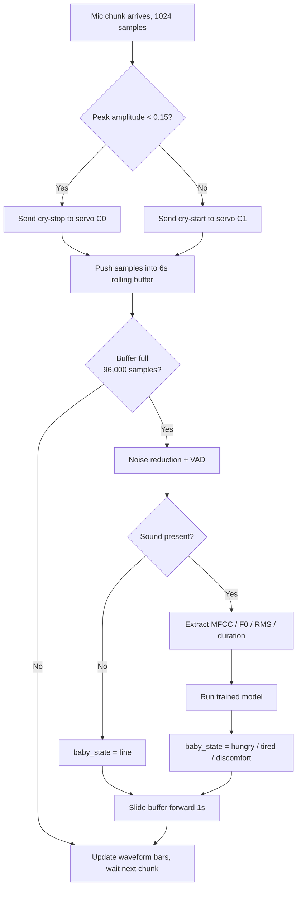
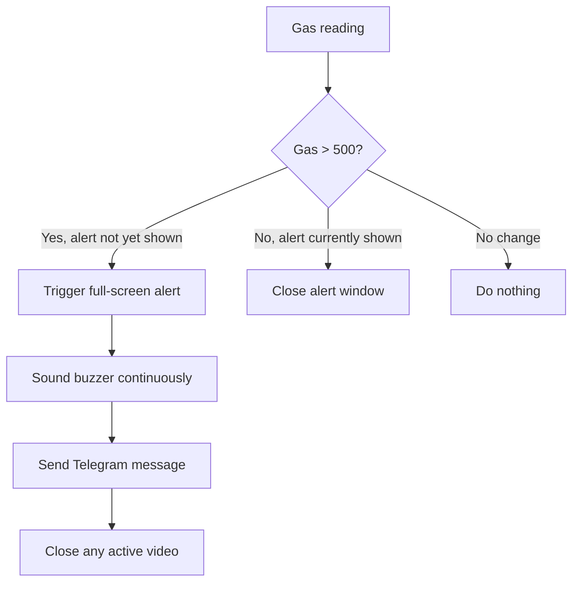

# not_so_smart_nursery

> drive:
https://drive.google.com/drive/folders/12p2iuLTkDaTgLdKXVU6b1ozY8I97_jF5

> tinkercad:[
https://www.tinkercad.com/things/jVpQvmCroje-copy-of-smart-nursery-guardian](https://www.tinkercad.com/things/jVpQvmCroje-copy-of-smart-nursery-guardian?sharecode=hjDszHumMTGjrFuFEeFtL6lL159uRarfmpMBbweMeB4)

# System Logic & Flow Overview

An AI-assisted embedded monitoring system that listens for infant cries, classifies their cause with a trained ML model, and coordinates a microcontroller to soothe, alert, and regulate the nursery environment in real time.

## 1. Architecture
The system is split across two devices that talk over a serial connection:

| Part | Runs On | Responsibility |
|---|---|---|
| **Python App (Tkinter GUI)** | Laptop | Microphone capture, noise reduction, VAD, ML cry classification, GUI display, video playback, Telegram alerts |
| **Firmware** | Microcontroller | Reads PIR, light (LDR), temperature (NTC), and gas sensors; drives servo, buzzer, RGB LED, lamp LED, and cooling fan; relays sensor events to the laptop |

**Key asymmetry:** audio never crosses the serial link - the laptop reads its own microphone directly, so cry detection and servo response have effectively zero latency. Every other sensor (motion, light, temperature, gas) is read by the microcontroller and relayed to the laptop over serial, so those messages are kept minimal to avoid flooding the link.

## 1.1 Servo Rocking Cycle (Actual Firmware Behavior)

While `cry == 1`, the servo repeats a fixed 4-second, 4-position cycle (not a simple back-and-forth between two angles):

| Time in cycle | Angle |
|---|---|
| 0–1s | 90° |
| 1–2s | 0° |
| 2–3s | 180° |
| 3–4s | 0° |

The cycle then restarts from 0°. As soon as `cry == 0`, the cycle timer resets and the servo stops advancing through positions.

## 2. Startup Sequence

1. **Microcontroller powers on** → initializes PIR, light, temperature, and gas sensors.
2. **Python app launches** → loads the pre-trained model (`already_trained_model.pkl`) once, opens the serial connection, and initializes the audio stream (PyAudio, 16 kHz, 1024-sample chunks).
3. **Tkinter GUI opens** in a calm/idle state and starts three independent polling loops via `window.after()`:
   - `update_gui` — reads serial data every 500 ms
   - `update_state` — evaluates `baby_state` every 500 ms and drives servo/video
   - `update_suggestion` — refreshes the on-screen suggestion text every 500 ms
   - The audio `read_stream` loop runs continuously (effectively every ~23 ms, gated by the mic buffer)

## 3. Live Audio Path (Cry Detection & Classification)

This is the core, time-critical loop and it runs on **two timescales at once**:

### 3.1 Fast path — every 1024-sample chunk (~64 ms), servo/VAD only
- Read a chunk from the mic.
- Normalize amplitude to `[-1, 1]`.
- If peak amplitude < 0.15 → treat as silence → **stop rocking** (`cry('C0')`).
- Otherwise → **start rocking** (`cry('C1')`) immediately.
- This gives the servo an instant reaction with no dependency on the ML model.

### 3.2 Slow path — every 6-second rolling window, ML classification
- Each chunk is also appended to a rolling buffer (`deque`, max 96,000 samples = 6 s @ 16 kHz).
- Once the buffer fills:
  1. Apply **spectral noise reduction** (`noisereduce`).
  2. Run **voice activity detection** via amplitude gating + `librosa.effects.split`.
  3. Extract a fixed-size feature vector: MFCC mean/std (13 coefficients each), F0 mean/std, RMS intensity mean/std, and duration.
  4. Feed the vector into the saved model → predicts `hungry`, `tired`, or `discomfort`.
  5. If the window was silent, `baby_state` resets to `"fine"`.
  6. The buffer then slides forward by 16,000 samples (1 second), so classification re-runs roughly once per second on overlapping windows.

## 4. Response Logic by Classified State

Once `baby_state` is set, it drives GUI text, suggestions, servo/video, and buzzer via three independent 500ms loops:

| State | GUI Label | Suggestion | Extra Action |
|---|---|---|---|
| `hungry` | "YOUR BABY IS hungry" | "Consider feeding your baby." | Plays calming video **only if** gas level ≤ 500 (safe) |
| `tired` | "YOUR BABY IS tired" | "URGENT! Your baby requires your care right now." | Sends `B1` to buzzer over serial |
| `discomfort` | "YOUR BABY IS discomfort" | "Consider checking diaper, clothing, position." | — |
| `fine` | "YOUR BABY IS fine" | "NO suggestions." | Closes video window if open; sends `B0` (buzzer off) |

Note: the video and buzzer are **mutually exclusive with each other's triggers** — any state other than `hungry` closes the video window, and only `tired` keeps the buzzer active.

A **DISMISS** button lets a caregiver manually clear the displayed state to "fine" without waiting for the model.

## 5. Microcontroller-Side Sensor Logic

While the laptop handles audio, the microcontroller independently manages four sensor-driven behaviors every cycle:

### 5.1 Motion (PIR) → "Baby Awake"
- The PIR pin is sampled **once per second** (not continuously) within an 8-second window.
- Each `HIGH` reading increments a counter.
- If the counter reaches **4** before the 8 seconds elapse ⇒ `awake = 1`, and the window/counter reset immediately to start a fresh 8-second cycle.
- If 8 seconds elapse without reaching 4 ⇒ counter resets to 0 and `awake = 0` for that cycle.
- This means "4 motions in 8 seconds" is really "4 of up to 8 one-second samples," which filters out a single passing hand or a blanket shift while still catching sustained movement.
- Reported to the laptop over serial as `Awake:1` / `Awake:0`.

### 5.2 Room Lighting (LDR + LED)
The lamp LED turns on only when **both** are true:
- The LDR reading is **≥ 500** (this is the raw condition in firmware — confirm on your specific wiring/voltage-divider orientation whether a higher analog reading corresponds to a darker or brighter room, since LDR circuits can be wired either way), **AND**
- Baby is awake (from PIR) **OR** a cry is currently active (`cry == 1`, set by the laptop's fast VAD path over serial).

This is the one actuator that depends on **both** local sensor data and a laptop signal — everything else on the microcontroller (fan, status light) is fully local.

### 5.3 Temperature → Fan Speed + Status Color
| Range | Status Light | Fan |
|---|---|---|
| Below 25°C | Blue | Off (PWM 0) |
| 25°C – 30°C | Green | Half speed (PWM 127) |
| Above 30°C | Red | Full speed (PWM 255) |

Color and fan speed are derived from the same reading, so they always agree. Temperature is computed from the analog pin as `((analogRead * 5/1024) - 0.5) * 100` — a linear 10 mV/°C-with-0.5V-offset formula (common for analog temperature ICs; if you're actually using a raw NTC thermistor rather than a linear sensor, this formula would need to be replaced with a proper thermistor/Steinhart-Hart conversion, since NTC resistance isn't linear with temperature).

### 5.4 Gas/Smoke → Safety Alert (Highest Priority)
- Threshold: gas value **> 500**.
- **Buzzer logic on the microcontroller** is actually a combined OR: it sounds if gas exceeds the threshold, *or* if the laptop has sent `B1` (tired-cry alert) — either condition alone drives the buzzer HIGH. Both silence the buzzer via `B0`/gas dropping below threshold.
- The Python side additionally shows a full-screen red alert (`trigger_alert.py`) and plays an alert sound (`mashkal.mp3` via `playsound3`) and an image (`5atar.png`) when gas is detected.
- A **Telegram message** ("SERIOUS ALERT! CHECK ON YOUR BABY RIGHT NOW!") is sent via a direct HTTPS GET to the Telegram Bot API (`telegram_bot.py`).
- Any active calming video is immediately closed — the safety alert takes precedence.
- Alert window closes automatically once gas value drops back to ≤ 500.

## 6. Serial Message Summary

| Direction | Message | Purpose |
|---|---|---|
| MCU → Laptop | Temp, Gas, Awake, Fan, Light | Periodic sensor state, parsed each 500 ms poll |
| Laptop → MCU | `cry-detected` / `cry-ended` | Starts/stops servo rocking, feeds LED logic |
| Laptop → MCU | Servo start / stop | Direct rocking control (fast VAD path) |
| Laptop → MCU | `B1` / `B0` | Buzzer on (tired) / off |

## 7. Machine Learning Pipeline (Offline, Pre-Deployment)

This is the actual training pipeline (`training_libraries` script), which goes further than the design report's summary — it stacks **offline audio augmentation** with an **in-pipeline oversampler and feature selector**.

### 7.1 Data & Split
- **Data**: Donate-A-Cry Corpus (~457 labeled recordings) — heavily imbalanced toward "hungry."
- **Split**: 80/20 train/test **per class**, done before any augmentation (`train_test_split(test_size=0.20)`), then the training portion is further split 85/15 into train/validation (`test_size=0.15, stratify=Y_train`).

### 7.2 Offline Audio Augmentation (Training Data Only, Minority Classes Only)
For `discomfort` and `tired` (⚠️ **not** `hungry`, which is skipped entirely since it's already the majority class), each training clip is expanded with **10 augmentation techniques**, each applied at two "extreme" parameter values to maximize diversity:

| Technique | Parameter Range |
|---|---|
| White noise injection | factor 0.01–0.25 |
| Time stretch | rate 0.65×–1.45× |
| Pitch shift | ±5 semitones |
| Gain change | 0.4×–2.2× |
| Time shift (roll) | ±30% of clip length |
| Dynamic range compression | clip threshold 0.15–0.85 |
| Low-pass filter | cutoff 1200–4500 Hz |
| High-pass filter | cutoff 200–1500 Hz |
| Time masking | mask 5%–25% of clip |
| Frequency masking (band-stop) | 500–1500 Hz / 2000–4000 Hz |

Each augmented clip is saved to disk and run through the same feature extractor as the originals, so augmentation happens in the **audio domain**, not the feature domain.

### 7.3 Feature Extraction
For every clip (real or augmented): spectral noise reduction (`noisereduce`) → voice activity detection (`librosa.effects.split`) → a feature vector of MFCC mean/std (13 coefficients each), F0 mean/std, RMS intensity mean/std, and duration (~31 numbers per clip).

### 7.4 In-Pipeline Modeling (Second Layer of Imbalance Handling)
On top of the offline audio augmentation, the actual `sklearn`/`imblearn` pipeline adds:
1. **SMOTE** — synthetic oversampling in feature space (a second, independent imbalance fix layered on top of the audio-level augmentation).
2. **`SelectFromModel`** — a Random Forest picks the most important features and prunes the rest down to those above the mean importance (per code comments, this resolves a "46 → 20 features" mismatch between training and inference).
3. **`RandomForestClassifier`** — the final classifier.

Hyperparameters (`n_estimators`, `max_features`, `max_depth`, `min_samples_leaf`, `min_samples_split`) are tuned via `RandomizedSearchCV` (200 iterations, 3-fold stratified CV), optimizing multi-class ROC-AUC (one-vs-rest).

### 7.5 Evaluation
- Standard and per-class (multilabel) confusion matrices.
- Training vs. testing accuracy gap checked explicitly to flag over/underfitting (gap > 0.10 ⇒ overfitting; both scores < 0.60 ⇒ underfitting).
- Macro F1 < 0.5 is flagged as a sign the model may still be biased despite the imbalance corrections.

### 7.6 Deployment
The **entire fitted pipeline** (SMOTE + SelectFromModel + RandomForest) — not just the raw classifier — is pickled to `already_trained_model.pkl`. This matters: because feature selection is baked into the saved pipeline, the live GUI can feed it the full ~31-dimension raw feature vector and the pipeline handles the reduction internally, rather than the live code needing to replicate the selection step. The model is loaded once at Python app startup and never retrained live.

> **Note:** the standalone `get_live_features` helper inside the training script uses a silence threshold of `0.01`, while the deployed GUI's live audio path (`update_servo` / `get_live_features` in the Tkinter app) uses `0.15`. If you're troubleshooting sensitivity differences between training-time expectations and live behavior, this is one place to check.

## 7.7 Serial Framing Detail

Every command from the laptop to the microcontroller is terminated with `\r` (added in the `cry()` helper in `serialpython.py`), and the firmware reads with `Serial.readStringUntil('\r')`. Sensor data flows the other direction as a single comma-separated line (e.g. `Temp:26.30,Gas:180.00,Awake:1,Fan:1,Light:0`), parsed on the laptop by splitting on `,` then `:`.

## 7.8 Alert & Video Helper Windows

- **`trigger_alert(window)`**: opens a maximized (`zoomed`), always-on-top `Toplevel` window with a red background, alert text, a warning image, and plays an alert sound (non-blocking) — then calls `send_alert()` to fire the Telegram message and returns the window handle so the main loop can track/destroy it.
- **`play(window)`**: opens a `Toplevel` video window using `pyvidplayer2`, drawing frames onto a `Canvas` at roughly 30 fps via a self-scheduling `update()` loop, and cleans up the video and window together whether it finishes naturally or the user closes it.

## 8. Hardware Components

- Arduino Nano
- NTC thermistor (temperature)
- PIR motion sensor
- Photoresistor / LDR (light)
- Gas sensor
- Buzzer
- RGB LED (status) + standalone LED (room lamp)
- L293D motor driver + DC motor/fan
- Micro servo (crib rocking)
- 4-layer PCB (Altium)
