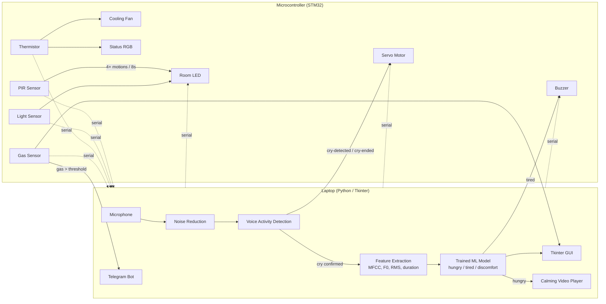
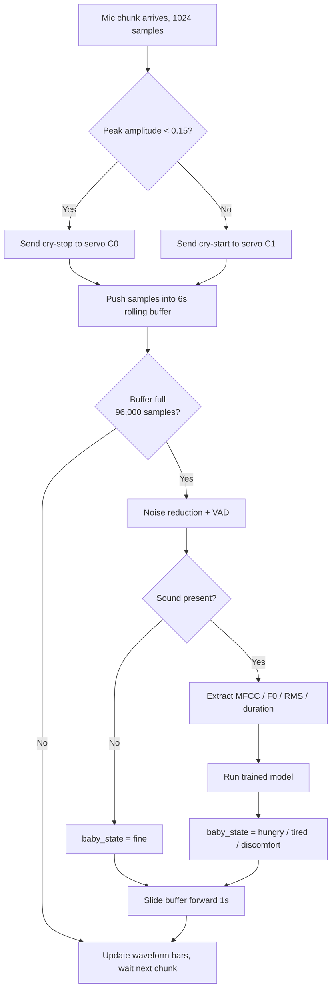
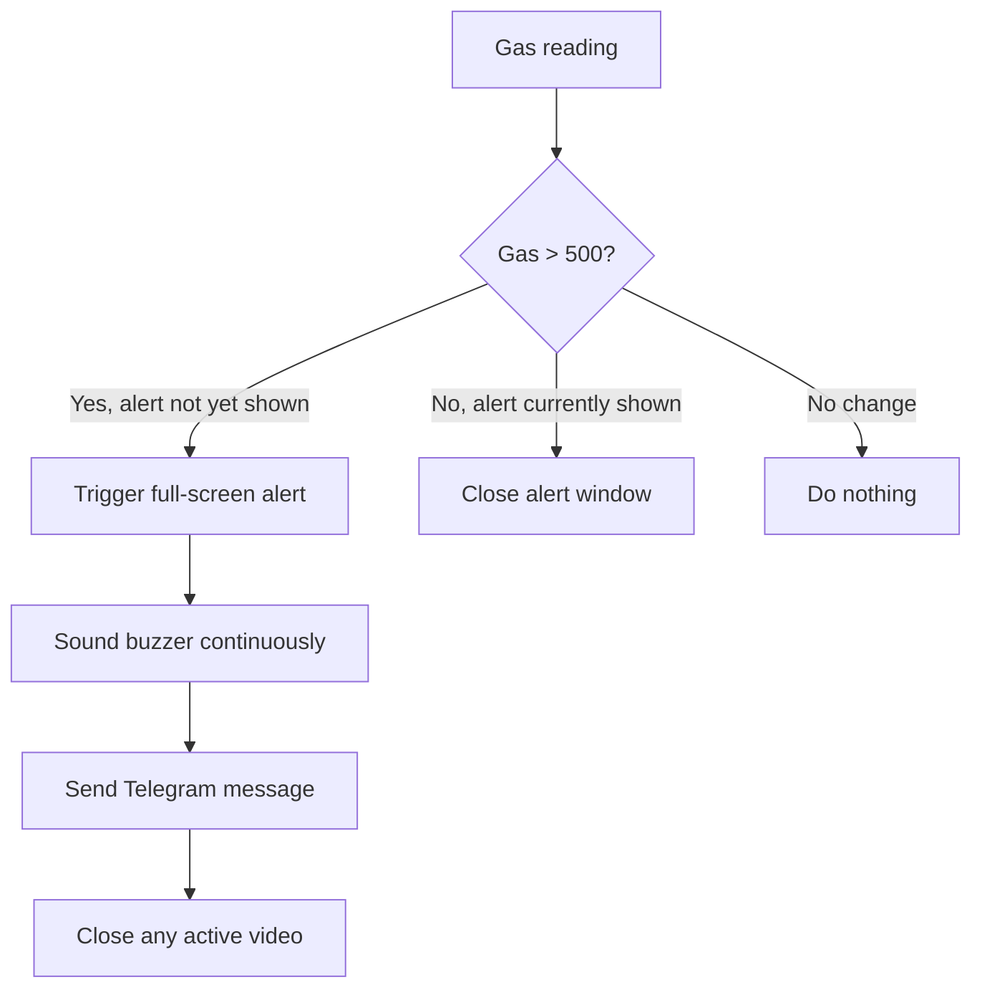

# not_so_smart_nursery

> drive:
https://drive.google.com/drive/folders/12p2iuLTkDaTgLdKXVU6b1ozY8I97_jF5

> tinkercad:
https://www.tinkercad.com/things/jVpQvmCroje-copy-of-smart-nursery-guardian

# Smart Nursery Guardian — System Logic & Flow Overview

An AI-assisted embedded monitoring system that listens for infant cries, classifies their cause with a trained ML model, and coordinates a microcontroller to soothe, alert, and regulate the nursery environment in real time.

## 1. Architecture at a Glance

The system is split across two devices that talk over a serial connection:

| Part | Runs On | Responsibility |
|---|---|---|
| **Python App (Tkinter GUI)** | Laptop | Microphone capture, noise reduction, VAD, ML cry classification, GUI display, video playback, Telegram alerts |
| **Firmware** | Microcontroller (STM32 BlackPill) | Reads PIR, light (LDR), temperature (NTC), and gas sensors; drives servo, buzzer, RGB LED, lamp LED, and cooling fan; relays sensor events to the laptop |

**Key asymmetry:** audio never crosses the serial link — the laptop reads its own microphone directly, so cry detection and servo response have effectively zero latency. Every other sensor (motion, light, temperature, gas) is read by the microcontroller and relayed to the laptop over serial, so those messages are kept minimal to avoid flooding the link.

## 2. Startup Sequence

1. **Microcontroller powers on** → initializes PIR, light, temperature, and gas sensors.
2. **Python app launches** → loads the pre-trained model (`already_trained_model.pkl`) once, opens the serial connection, and initializes the audio stream (PyAudio, 16 kHz, 1024-sample chunks).
3. **Tkinter GUI opens** in a calm/idle state and starts three independent polling loops via `window.after()`:
   - `update_gui` — reads serial data every 500 ms
   - `update_state` — evaluates `baby_state` every 500 ms and drives servo/video
   - `update_suggestion` — refreshes the on-screen suggestion text every 500 ms
   - The audio `read_stream` loop runs continuously (effectively every ~23 ms, gated by the mic buffer)

## 3. Live Audio Path (Cry Detection & Classification)

This is the core, time-critical loop and it runs on **two timescales at once**:

### 3.1 Fast path — every 1024-sample chunk (~64 ms), servo/VAD only
- Read a chunk from the mic.
- Normalize amplitude to `[-1, 1]`.
- If peak amplitude < 0.15 → treat as silence → **stop rocking** (`cry('C0')`).
- Otherwise → **start rocking** (`cry('C1')`) immediately.
- This gives the servo an instant reaction with no dependency on the ML model.

### 3.2 Slow path — every 6-second rolling window, ML classification
- Each chunk is also appended to a rolling buffer (`deque`, max 96,000 samples = 6 s @ 16 kHz).
- Once the buffer fills:
  1. Apply **spectral noise reduction** (`noisereduce`).
  2. Run **voice activity detection** via amplitude gating + `librosa.effects.split`.
  3. Extract a fixed-size feature vector: MFCC mean/std (13 coefficients each), F0 mean/std, RMS intensity mean/std, and duration.
  4. Feed the vector into the saved model → predicts `hungry`, `tired`, or `discomfort`.
  5. If the window was silent, `baby_state` resets to `"fine"`.
  6. The buffer then slides forward by 16,000 samples (1 second), so classification re-runs roughly once per second on overlapping windows.

## 4. Response Logic by Classified State

Once `baby_state` is set, it drives GUI text, suggestions, servo/video, and buzzer via three independent 500ms loops:

| State | GUI Label | Suggestion | Extra Action |
|---|---|---|---|
| `hungry` | "YOUR BABY IS hungry" | "Consider feeding your baby." | Plays calming video **only if** gas level ≤ 500 (safe) |
| `tired` | "YOUR BABY IS tired" | "URGENT! Your baby requires your care right now." | Sends `B1` to buzzer over serial |
| `discomfort` | "YOUR BABY IS discomfort" | "Consider checking diaper, clothing, position." | — |
| `fine` | "YOUR BABY IS fine" | "NO suggestions." | Closes video window if open; sends `B0` (buzzer off) |

Note: the video and buzzer are **mutually exclusive with each other's triggers** — any state other than `hungry` closes the video window, and only `tired` keeps the buzzer active.

A **DISMISS** button lets a caregiver manually clear the displayed state to "fine" without waiting for the model.

## 5. Microcontroller-Side Sensor Logic

While the laptop handles audio, the microcontroller independently manages four sensor-driven behaviors every cycle:

### 5.1 Motion (PIR) → "Baby Awake"
- Counts PIR triggers in an 8-second rolling window.
- **4 or more motions** within that window ⇒ baby is awake (filters out false positives from a passing hand or shifting blanket).
- Reported to the laptop over serial.

### 5.2 Room Lighting (LDR + LED)
The lamp LED turns on only when **both** are true:
- Room is dark (LDR reading below threshold), **AND**
- Baby is awake (from PIR) **OR** a cry is currently being detected (signal relayed from the laptop).

This is the one actuator that depends on **both** local sensor data and a laptop signal — everything else on the microcontroller (fan, status light) is fully local.

### 5.3 Temperature → Fan Speed + Status Color
| Range | Status Light | Fan |
|---|---|---|
| Below 25°C | Blue | Off |
| 25°C – 30°C | Green | Half speed |
| Above 30°C | Red | Full speed |

Color and fan speed are derived from the same reading, so they always agree.

### 5.4 Gas/Smoke → Safety Alert (Highest Priority)
- Threshold: gas value **> 500**.
- On trigger: buzzer sounds continuously, GUI raises a full-screen red alert (`trigger_alert`), and a **Telegram message** is sent to the caregiver's phone (via a BotFather-created bot).
- Any active calming video is immediately closed — the safety alert takes precedence.
- Alert clears automatically once gas value drops back to ≤ 500.

## 6. Serial Message Summary

| Direction | Message | Purpose |
|---|---|---|
| MCU → Laptop | Temp, Gas, Awake, Fan, Light | Periodic sensor state, parsed each 500 ms poll |
| Laptop → MCU | `cry-detected` / `cry-ended` | Starts/stops servo rocking, feeds LED logic |
| Laptop → MCU | Servo start / stop | Direct rocking control (fast VAD path) |
| Laptop → MCU | `B1` / `B0` | Buzzer on (tired) / off |

## 7. Machine Learning Pipeline (Offline, Pre-Deployment)

1. **Data**: Donate-A-Cry Corpus (457 labeled recordings) — 84% hungry, 6% discomfort, 5% tired.
2. **Class imbalance fix**: augment minority classes (pitch shift ±2 semitones, time-stretch 0.9–1.1x, light noise injection) — applied **only** to the training split, never to test data.
3. **Split**: 80/20 train/test, done **before** augmentation.
4. **Cleaning**: spectral noise reduction, then voice activity detection to discard silence.
5. **Features**: MFCC mean/std, F0 mean/std, RMS intensity mean/std, duration — one fixed-length row per clip.
6. **Model**: Random Forest / SVM (classical ML, trains in seconds, no GPU required).
7. **Validation**: confusion matrix checked per class (not just overall accuracy) to catch a model that just predicts "hungry" every time.
8. **Deployment**: trained model is pickled once (`already_trained_model.pkl`) and loaded a single time when the Python app starts; it is never retrained live.

## 8. Hardware Components

- STM32 BlackPill (or equivalent microcontroller)
- NTC thermistor (temperature)
- PIR motion sensor
- Photoresistor / LDR (light)
- Gas sensor
- Buzzer
- RGB LED (status) + standalone LED (room lamp)
- L293D motor driver + DC motor/fan
- Micro servo (crib rocking)
- 4-layer PCB (Altium): schdoc, pcbdoc, schlib, pcblib, JLCPCB design rules

## 9. Design Rationale

- **Why split laptop/microcontroller?** AI, audio DSP, and GUI rendering need Python's libraries and compute; the microcontroller can't support that. Conversely, real-time actuator timing (servo, buzzer) needs the microcontroller's low-level precision. This "edge device for sensing/actuation + smart device for decisions" split mirrors standard production IoT architecture.
- **Why rock before classifying?** Soothing is the same first instinct a human caregiver has — the servo starts on raw VAD (~64 ms reaction), while classification (needs a 6-second window) catches up in the background.
- **Why gate the video on gas level?** A safety hazard always overrides a comfort response — the system will never distract a caregiver with a calming video while gas/smoke is detected.
